## Executive Summary

| File | SHA256 |
|----|----|
| RAT.Unknown.exe | 248D491F89A10EC3289EC4CA448B19384464329C442BAC395F680C4F3A345C8C |

- **Purpose**: Summarize findings for non-technical stakeholders.
- **Malware Description**: \[Briefly describe the malware, e.g., type, purpose\]
- **Key Findings**: \[Summarize infection vector, payload, impact\]
- **Impact Assessment**: \[Describe impact, e.g., data loss, system compromise\]
- **Recommendations**: \[List mitigation or containment steps\]

## Identification

| Type | Value |
|----|----|
| File Name | RAT.Unknown.exe |
| File Size | 508 KB |
| SHA256 | 248D491F89A10EC3289EC4CA448B19384464329C442BAC395F680C4F3A345C8C |
| MD5 | 689FF2C6F94E31ABBA1DDEBF68BE810E |
| Platform | Windows |
| Language | Nim |
| Delivery | N/A |

------------------------------------------------------------------------

## Static Analysis

**Networking Imports**

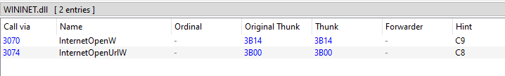
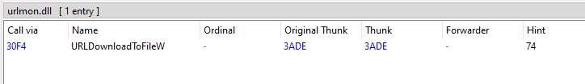

**Shell Execute imports**

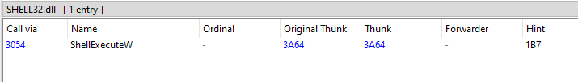

**Strings**

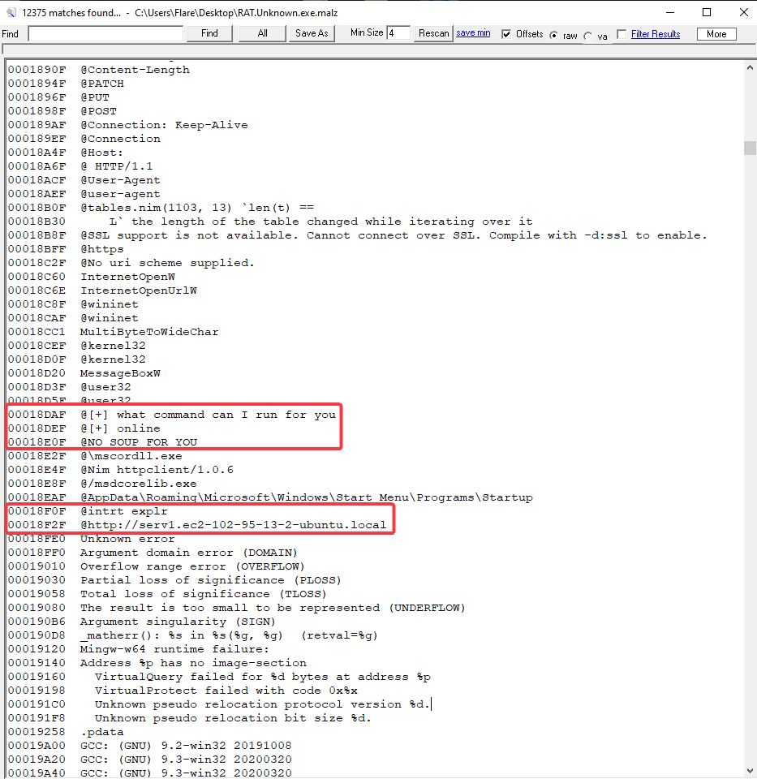

## Dynamic Analysis

`RAT.Unknown.exe` **run with NO network access**

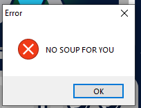

**Running** the .exe *with* network connection provides no message box. However, there is network traffic:

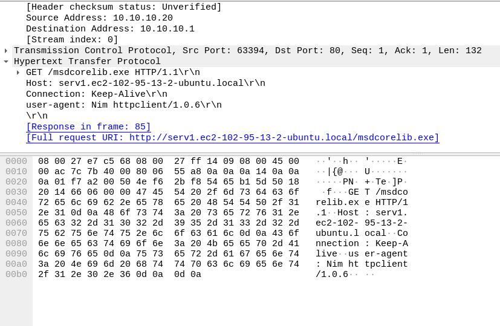
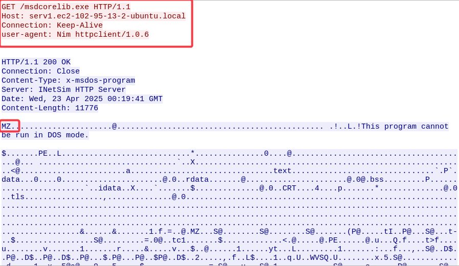

*Attempts to pull msdcorelib.exe from `serv1.ec2-102-95-13-2-ubuntu.local`*

**Files Dropped**:  
**Renames** downloaded file to `mscordll.exe`

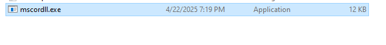  
*mscordll.exe placed in `%appdata%/Roaming/Microsoft/Windows/Start Menu/Programs/Startup/`*

## Indicators of Compromise (IOCs)

### File Hashes

`RAT.Unknown.exe`

| IOC Type | Value |
|----|----|
| MD5 | 689FF2C6F94E31ABBA1DDEBF68BE810E |
| SHA256 | 248D491F89A10EC3289EC4CA448B19384464329C442BAC395F680C4F3A345C8C |
| SSDeep | Unknown |
| File Path | N/A |

`mscordll.exe`

| IOC Type | Value |
|----|----|
| MD5 | Unknown |
| SHA256 | Unknown |
| SSDeep | Unknown |
| File Path | `%appdata%/Roaming/Microsoft/Windows/Start Menu/Programs/Startup/` |

### Network

| IOC Type     | Value                                |
|--------------|--------------------------------------|
| IP Addresses | `localhost:5555`                     |
| Domain       | `serv1.ec2-102-95-13-2-ubuntu.local` |
| URLs         | `serv1.ec2-102-95-13-2-ubuntu.local` |
| Ports        | `5555`                               |

### System

| IOC Type    | Value                                     |
|-------------|-------------------------------------------|
| Files       | `RAT.Unknown.exe`                         |
| Mutexes     | `mscordll.exe`                            |
| Persistence | `mscordll.exe` placed into startup folder |

## Behavioral Summary

**Persistence**:  
Stores `mscordll.exe` in `%appdata%/Roaming/Microsoft/Windows/Start Menu/Programs/Startup/`  
*See appendix A.1*

**C2 Communication**:  
`RAT.Unknown.exe` listens on port `5555` for shell commands  
*See appendix A.2 - A.3*

## Mitigation and Recommendations

\[Add mitigation steps here\]

------------------------------------------------------------------------

## Conclusion

\[Add summary conclusion\]

## Appendices

### Appendix A

#### Screens

#### A.1 - Persistence

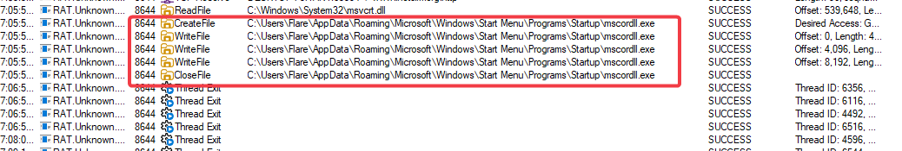

#### A.2 - C2

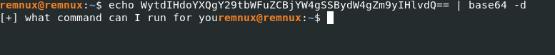

#### A.3 - C2 continued

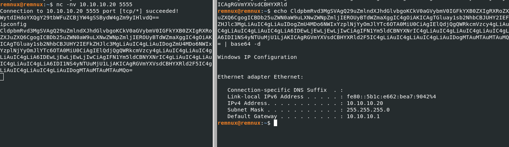

------------------------------------------------------------------------

### Appendix B

#### MITRE ATT&CK Mapping

| Technique | ID  | Description |
|-----------|-----|-------------|
|           |     |             |

------------------------------------------------------------------------

### Appendix C

#### YARA Rule

``` yara
rule Untitled_Detection
{
    strings:
        $s1 = "malicious_string" ascii
    condition:
        $s1
}
```

------------------------------------------------------------------------

## Remediation / Recommendations

> Suggestions for containment, blocking, or future prevention.

------------------------------------------------------------------------
